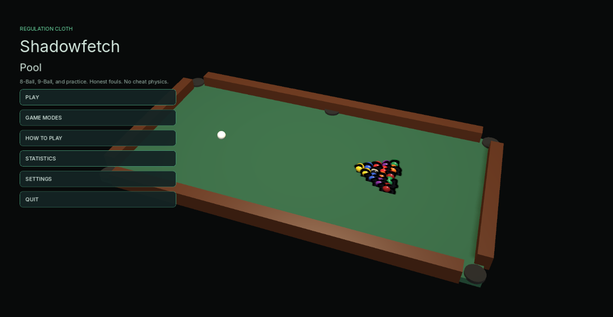
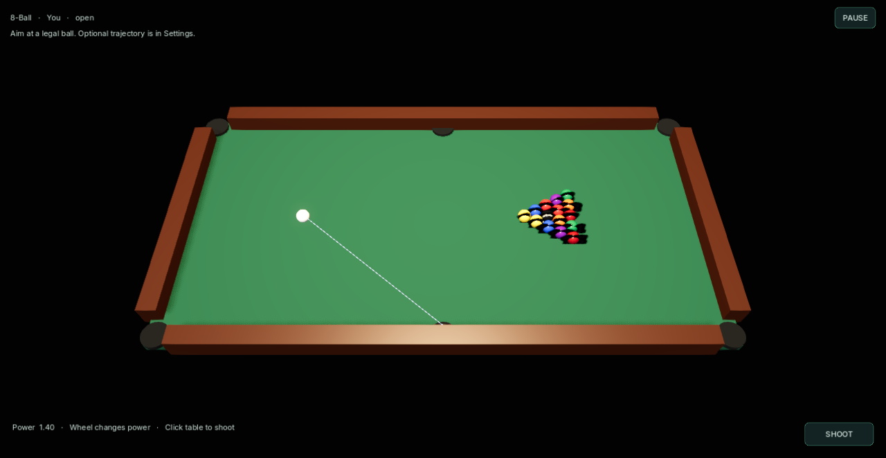

# Shadowfetch Pool

8-Ball, 9-Ball, and practice for Linux. Jolt physics, honest fouls, fictional match play. Sibling to Shadowfetch Roulette — same dark family, not a clone.





## Download

Get `shadowfetch-pool-1.0.0-linux-x86_64.tar.gz` from the [latest release](https://github.com/Shadowfetchapps/shadowfetch-pool/releases/latest) (x86_64 Linux), then:

```bash
sha256sum -c shadowfetch-pool-1.0.0-linux-x86_64.tar.gz.sha256
tar -xzf shadowfetch-pool-1.0.0-linux-x86_64.tar.gz
cd shadowfetch-pool-1.0.0-linux-x86_64
./tools/install_linux.sh
```

## Run

```bash
~/.local/bin/shadowfetch-pool
```

Development: `godot --path .`

## Tests

```bash
./tools/run_tests.sh
```

Covers break law, group assignment, every major foul, 8-ball win/loss, 9-ball combos, and thousands of randomized rule resolutions. Settings recover from corrupt files.

## Export and install

```bash
./tools/export_linux.sh
./tools/install_linux.sh
```

If `rsvg-convert` is missing: `sudo apt install librsvg2-bin desktop-file-utils`

## Controls

- Move the mouse to aim
- Wheel for power
- Click the cloth to shoot
- Ball in hand: click to place the cue
- Esc pause

## Assets

Inter fonts — SIL OFL 1.1. Meshes, icon, and audio are original.

No real-money gambling. No telemetry.
